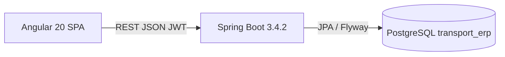
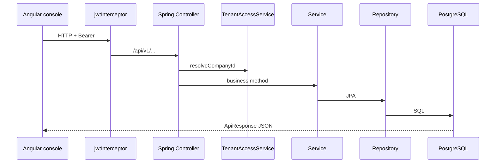

# ARCHITECTURE.md

Architecture as implemented in this repository. Planned items are labeled. Do not assume layers that are not here (no MapStruct mappers, no NgRx store, no JSONB, no multi-line journals).

---

## System context



Local frontend (`environment.development.ts`) calls `http://localhost:8080/api/v1`. `proxy.conf.json` also proxies `/api`, Swagger, and OpenAPI to port **8080**. Default `environment.ts` uses relative `/api/v1`.

---

## Frontend architecture

### Angular version and style

- **Angular 20.3** (standalone; no NgModules for feature apps).
- `appConfig` in `src/app/app.config.ts`: router, HTTP client with interceptor, animations.
- Zone change detection with event coalescing.

### Project structure

```text
transport-frontend/src/app/
├── app.routes.ts
├── app.config.ts
├── auth/                 login, forgot/reset password, profile, access-denied
├── components/           feature consoles (one folder per screen)
├── guards/               auth, setup, subscription
├── interceptors/         jwt.interceptor.ts
├── layout/               app-shell
├── services/             HTTP API wrappers
├── shared/               older shared widgets (data-table, dialogs)
├── shared-ui/            ff-* design system (base, advanced, layout, foundation)
└── environments/
```

### Modules

There is **no** Angular NgModule feature split. Each console is a **standalone component** loaded by route.

### Components (feature consoles)

| Route | Component | Domain |
|-------|-----------|--------|
| `/dashboard` | `DashboardComponent` | KPIs, alerts, PM due panel |
| `/vehicles` | `VehicleDetailsConsoleComponent` | Fleet |
| `/drivers` | `DriverDetailsConsoleComponent` | Drivers, salary, attendance |
| `/customers` | `CustomerDetailsConsoleComponent` | Customers |
| `/materials-quarries` | `MaterialQuarryConsoleComponent` | Materials, quarries |
| `/bookings` | `BookingDetailsConsoleComponent` | Bookings |
| `/trips-planning` | `TripDetailsConsoleComponent` | Trips |
| `/fuel-logs` | `FuelDetailsConsoleComponent` | Fuel |
| `/expense-logs` | `ExpenseDetailsConsoleComponent` | Expenses |
| `/billing-invoices` | `InvoiceDetailsConsoleComponent` | Invoices |
| `/payment-logs` | `PaymentDetailsConsoleComponent` | Receipts |
| `/accounts-ledger` | `AccountsDetailsConsoleComponent` | GL / accounts |
| `/reports-bi` | `ReportDetailsConsoleComponent` | Reports |
| `/masters` | `MasterManagementComponent` | Branches / lookups (menu: Branch Master) |
| `/users-roles` | `UserRoleManagementComponent` | Users and roles |
| `/company-admin` | `CompanyAdministrationComponent` | Company settings |
| `/platform-admin` | `PlatformAdminComponent` | SaaS (SUPER_ADMIN) |
| `/mobility-ai` | `MobilityDetailsConsoleComponent` | GPS/AI UI |
| `/setup` | `SetupWizardComponent` | First-run |
| `/renewal` | `RenewalComponent` | Subscription |
| `/ui-playground` | `FfPlaygroundComponent` | Design-system playground |

### Services

HTTP services live in `src/app/services/` (examples: `booking-mgmt.service.ts`, `dashboard.service.ts`, `auth.service.ts`). They typically call `/api/v1/...` and unwrap `ApiResponse`.

**State management:** Angular **signals** on components (e.g. app-shell menu, auth `currentUser()`). **NgRx / Akita / global store: not currently identified.**

### Models / interfaces

TypeScript interfaces are declared next to services/components (e.g. dashboard DTOs). There is no single generated OpenAPI client **identified**.

### Routing

`app.routes.ts`:

- Public: `/login`, `/forgot-password`, `/reset-password`, `/access-denied`
- Auth: `/setup` (`authGuard` only)
- Auth + subscription: `/renewal`
- Shell (`AppShellComponent`): remaining routes with `authGuard` + `subscriptionGuard`
- Dashboard also uses `setupGuard`
- Wildcard → `/login`

### Guards

| Guard | Role |
|-------|------|
| `authGuard` | Must be logged in |
| `subscriptionGuard` | Expired subscription → renewal (company admin) or logout (others); SUPER_ADMIN bypass |
| `setupGuard` | Incomplete setup → `/setup`; SUPER_ADMIN bypass; API failure **fails open** |

### Interceptors

`jwtInterceptor`:

- Strips `Authorization` on public auth URLs
- Attaches `Bearer` token from `localStorage.token`
- On `403` with message `SUBSCRIPTION_EXPIRED`, sets expired flag and routes to `/renewal`

### HTTP communication

- `HttpClient` via `provideHttpClient(withInterceptors([jwtInterceptor]))`
- REST JSON to Spring Boot
- No GraphQL **identified**

### Shared / common UI

- **`shared-ui/`**: `ff-textbox`, `ff-grid`, `ff-dashboard-card`, `ff-status-badge`, page headers, tokens (`ff-tokens.css`)
- **`shared/`**: data-table, confirmation dialog, KPI cards, drawers
- **Recommended:** reuse `ff-*` and existing console layout; do not add a new component library.

### UI framework / libraries

- Angular Material + CDK
- Tailwind CSS 4 (`@tailwindcss/postcss`)
- No extra chart library **required** by package.json beyond the above (do not add Chart.js/etc. without need)

### Environment configuration

| File | `apiUrl` |
|------|----------|
| `environment.ts` | `/api/v1` |
| `environment.development.ts` | `http://localhost:8080/api/v1` |
| `environment.production.ts` | present (use file; do not assume host) |

### Error handling

Interceptor handles subscription 403. Other errors are handled per console (subscribe error callbacks). A global HTTP error toast interceptor was **not currently identified**.

### Validation

Angular forms on consoles; shared validation messages under `shared-ui/infrastructure/constants/validation-messages.ts`. Backend Bean Validation + `BusinessValidationException` remain the source of truth for business rules.

### Authentication / authorization (UI)

- JWT in `localStorage`
- Roles on `currentUser().roles` (e.g. `SUPER_ADMIN` hides company menus, shows Platform Admin)
- Route guards as above
- Fine-grained UI permission directives: **not currently identified** as a global pattern; many screens rely on backend `@PreAuthorize` + role checks in shell

---

## Backend architecture

### Java / Spring Boot

- Java **17**
- Spring Boot **3.4.2** (`pom.xml` parent)
- Package root: `com.transport.erp`
- Entry: `TransportBackendApplication` (`@SpringBootApplication` only)

### Package structure

```text
com.transport.erp
├── controller/     REST endpoints, mostly /api/v1/...
├── service/        business logic
├── repository/     Spring Data JPA
├── model/          JPA entities (~65)
├── dto/            request/response DTOs + ApiResponse
├── security/       JWT filter, UserDetails, TenantAccessService
├── exception/      GlobalExceptionHandler, BusinessValidationException
└── config/         SecurityConfig, CORS, etc.
```

Typical call chain:

```text
Controller → TenantAccessService.resolveCompanyId
          → Service (@Transactional where financial)
          → Repository
          → PostgreSQL
```

### Controllers

REST, `/api/v1/...`, return `ApiResponse<T>`. Many use `@PreAuthorize("hasAnyRole(...)")`.

Notable prefixes:

| Prefix | Area |
|--------|------|
| `/api/v1/auth` | Login, refresh, password, plans (public subset) |
| `/api/v1/platform-admin` | SUPER_ADMIN |
| `/api/v1/bookings`, `/trips`, `/fuel`, `/expenses` | Operations |
| `/api/v1/invoices`, `/sales-invoices`, `/receipts` | AR |
| `/api/v1/accounts`, `/journal` | GL |
| `/api/v1/driver-payrolls` | Payroll |
| `/api/v1/dashboard`, `/reports` | BI |
| `/api/v1/maintenance` | PM rules / due |
| `/api/v1/gps`, `/api/v1/ai` | Stub mobility |

Public matchers in `SecurityConfig`: login, refresh, forgot/reset password, plans, Swagger/OpenAPI. **All other APIs require authentication.**

### Services / repositories / entities

- Services encapsulate status transitions (especially payroll, receipts).
- Repositories: Spring Data JPA interfaces.
- Entities: JPA + Lombok; most extend `BaseEntity`.

### DTOs / mappers

- DTOs used for payroll create/pay, dashboard, receipts, setup, platform admin, etc.
- Some endpoints return **entities** directly inside `ApiResponse` (e.g. payroll get-by-id).
- **MapStruct:** dependency present; **no mapper interfaces found**. Mapping is manual in services.

### Exception handling

`GlobalExceptionHandler` (`@RestControllerAdvice`) maps:

- `BusinessValidationException` → 400 + `errors` list
- `IllegalArgumentException` → 400
- `BadCredentialsException` → 401
- `AccessDeniedException` → 403
- `MethodArgumentNotValidException` → 400 field errors
- `DataIntegrityViolationException` → 400/409 style conflict handling
- Other handlers exist in the same class (read the file before adding duplicates)

Security entry point returns JSON:

```json
{"success":false,"message":"Unauthorized","data":null,"errors":["Authentication required"]}
```

### Validation

- `spring-boot-starter-validation`
- Service-layer `BusinessValidationException` with error codes/titles for payroll and similar

### Security / authentication

- Stateless JWT (`JwtAuthenticationFilter` before `UsernamePasswordAuthenticationFilter`)
- BCrypt
- CORS: localhost / 127.0.0.1 any port, credentials allowed
- CSRF disabled (JWT API)
- `DaoAuthenticationProvider` + `CustomUserDetailsService`

### Authorization / permissions

- HTTP: authenticated by default; platform-admin role-restricted
- Method: `@PreAuthorize` on many controllers
- **`@EnableMethodSecurity` was not found** on `TransportBackendApplication`. If method security appears inactive in a new environment, enable it explicitly rather than inventing a second permission framework.
- Tenant: `TenantAccessService` — SUPER_ADMIN may pass `companyId`; everyone else is forced to their user `companyId`
- `AppPermission` / role-permission tables exist for RBAC data; do not ignore them when editing user-role screens

### Transactions

Use `@Transactional` on financial services (payroll approve/pay/cancel is the reference pattern). Do not post JVs without a transaction.

### Configuration

| File | Role |
|------|------|
| `application.yml` | App name, `dev` profile default, Jackson UTC, bootstrap flag, springdoc |
| `application-dev.yml` | Postgres URL `transport_erp`, Flyway, `ddl-auto: validate`, SQL debug |
| `application-prod.yml` | Production profile |
| `application-test.yml` | Tests |

Bootstrap (`app.bootstrap.enabled`) can create company/admin/lookups; **never creates business transactions** (comment in yml).

### Logging

Logback via Spring. Dev profile logs Hibernate SQL at DEBUG. Audit actions also go through an audit service (payroll logs `DRIVER_PAYROLL_*` actions).

### API response structure

Always:

```json
{
  "success": true,
  "message": "…",
  "data": {},
  "errors": null
}
```

Errors: `success: false`, `message`, `errors: [ "..."]`.

Paginated list endpoints often put Spring `Page<T>` in `data`.

---

## Database architecture

See `DATABASE_DESIGN.md` for table-level detail.

### PostgreSQL usage

- JDBC: `jdbc:postgresql://localhost:5432/transport_erp`
- Hibernate dialect: PostgreSQL
- **Flyway** owns schema (`locations: classpath:db/migration`, `baseline-on-migrate: true`)
- Dev has `repair-on-migrate: true` (checksum repair). **Do not rely on repair in production.**

### Tables / entities

~65 JPA models. Core operational/finance tables: customers, materials, quarries, bookings, trips, expenses, fuel, sales_invoices, customer_receipts, customer_ledgers, chart_of_accounts, journal_vouchers, drivers, driver_salaries, driver_attendance, driver_payrolls, vehicles, maintenance_rules, etc.

### Relationships

JPA `@ManyToOne` / `@OneToMany` with FK columns. Header/detail: booking, trip, invoice, receipt allocations.

### Primary keys

`BIGSERIAL` / `IDENTITY` `id` on `BaseEntity`.

### Foreign keys

Declared in Flyway (e.g. `trips.booking_id → bookings`). Some later columns are nullable (trip vehicle/driver).

### Indexes

Added in various migrations (trip booking/vehicle/driver; payroll company+status; receipt reporting indexes V39–V43). Add indexes in **new Flyway files**, not ad-hoc SQL.

### Constraints

Unique document numbers; payroll `UNIQUE (driver_id, pay_year, pay_month)`; tenant-scoped codes in later migrations (V34–V37).

### Enums

**Almost none at DB/JPA enum level.** Statuses are `VARCHAR` strings. Java comments document allowed values; they can drift from dashboard usage.

### JSON / JSONB

**Not currently identified** in entities or migrations.

### Migration mechanism

Flyway versions **V1–V53**. V1 is an empty baseline comment. Never edit applied production migrations; add `V54__...`.

### Conventions

`BaseEntity` columns on most tables:

- `id`, `code`, `name`, `description`, `status`
- `company_id`, `branch_id`
- `created_by`, `created_date`, `updated_by`, `updated_date`
- `is_deleted`, `version` (optimistic lock)

Early migrations missed some of these; V18–V27 / V50 backfilled columns. New tables **must** include the full set.

---

## Integration (request path)



---

## Architectural conventions for future work

1. **Add features vertically:** entity + Flyway + repository + service + controller + Angular console + service.ts.
2. **Do not introduce NgRx, MapStruct mappers, or a new UI kit** unless the user asks. The pom already has unused MapStruct.
3. **Reuse `ApiResponse` and `BaseEntity`.**
4. **Tenant-scope every query.**
5. **String statuses:** search all usages before renaming.
6. **Financial posting:** calculate in DRAFT; post GL on explicit approve/pay; reverse with new JVs.
7. **Keep GPS/AI changes isolated** unless completing those stubs on purpose.
8. **PM due vs fitness vs service log** are three different concepts — keep APIs separate.
9. **Controllers should stay thin.** Status machines belong in services.
10. **Follow existing console UX** (filters, grid, drawer/form) instead of a new page layout.
