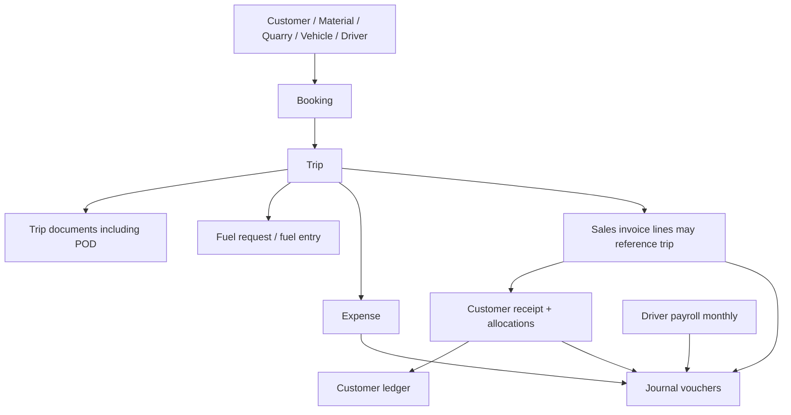
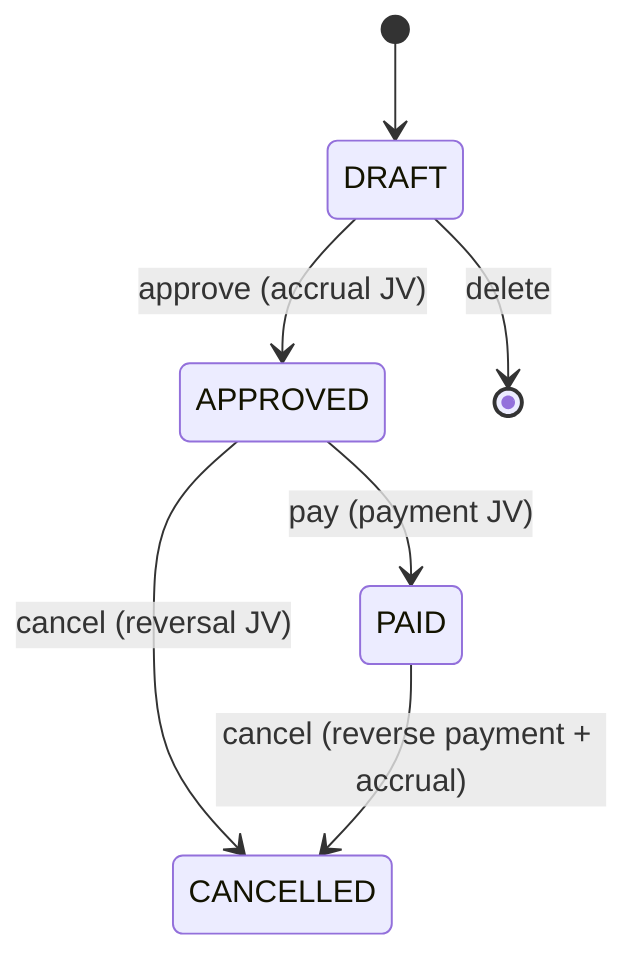
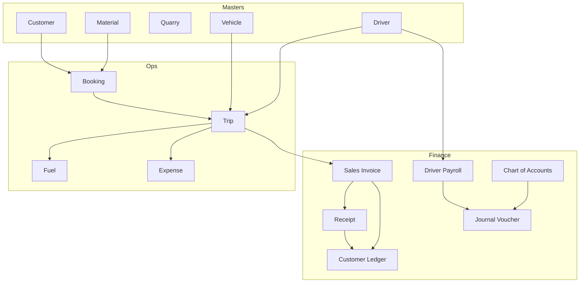

# BUSINESS_FLOW.md

End-to-end Transport ERP business flow.

**Legend**

| Marker | Meaning |
|--------|---------|
| **Exists** | Implemented in backend and/or UI |
| **Partial** | Some data or screens exist; not a full stage module |
| **Planned** | Product goal; not implemented as a dedicated module |
| **Configurable / planned** | May differ by company; do not hard-code as the only legal flow |

This business does **not** have to match every other transport company. Where the code uses free-text statuses or optional FKs, treat those as extension points.

---

## Lifecycle overview

### Target product lifecycle

```mermaid
flowchart LR
  C[Customer] --> MR[Material Requirement]
  MR --> B[Booking]
  B --> A[Vehicle and Driver Assignment]
  A --> Q[Quarry / Loading]
  Q --> T[Trip]
  T --> Ds[Dispatch]
  Ds --> Dl[Delivery]
  Dl --> P[POD]
  P --> E[Expenses]
  E --> S[Driver Settlement]
  S --> I[Invoice]
  I --> Pay[Payment]
  Pay --> Acc[Accounts]
  Acc --> R[Reports]
```

### What the codebase actually chains today

Invoice does **not** currently require POD, completed trip, or driver settlement. Those gates are **Planned / configurable**.

---

## 1. Customer

| | |
|--|--|
| **Status** | **Exists** |
| **Purpose** | Party who buys material/transport |
| **Main action** | Create/maintain customer master |
| **Important data** | Name, code, phone, email, address, GST, credit limit |
| **Entities** | `Customer`, `CustomerContact`, `CustomerDeliverySite`, `CustomerDocument`, `CustomerLedger` |
| **Input** | Master form in Customer console (`/customers`) |
| **Output** | Customer record usable on bookings, invoices, receipts |
| **Lifecycle** | `BaseEntity.status` (typically `ACTIVE`); soft delete `is_deleted` |
| **Related** | Booking, invoice, receipt, ledger |

Credit-limit **enforcement at booking/invoice time** was **not currently identified** as a hard block in this documentation pass. Treat as **configurable / planned** unless a service already validates it (search `creditLimit` before adding a new rule).

---

## 2. Material requirement

| | |
|--|--|
| **Status** | **Partial / Planned as a separate document** |
| **Purpose** | What material, how much, at what commercial rates |
| **Main action** | Capture demand before or as part of booking |
| **Important data** | Material, quantity, rate, transport rate, royalty, loading charge, GST % |
| **Entities today** | `BookingDetail` (and later `TripDetail`, `SalesInvoiceDetail`) |
| **Input** | Booking line items |
| **Output** | Quantities and rates that flow to trips and invoices |
| **Lifecycle** | Follows parent booking |
| **Related** | `Material`, `MaterialPrice`, `UomMaster` |

A standalone **Material Requirement** header table is **Planned / Not implemented yet**. Do not invent one unless explicitly requested.

---

## 3. Booking

| | |
|--|--|
| **Status** | **Exists** |
| **Purpose** | Commercial order: who, where, which materials, rates |
| **Main action** | Create booking with lines; approve for operations |
| **Important data** | `booking_number`, `booking_date`, customer, delivery site, priority, remarks, line quantities/rates |
| **Entities** | `Booking`, `BookingDetail` |
| **API** | `/api/v1/bookings` |
| **UI** | `/bookings` |
| **Input** | Customer + material lines + optional delivery site |
| **Output** | Booking that trips can reference (`trips.booking_id` required) |
| **Lifecycle (entity comment)** | `DRAFT`, `PENDING` (default), `APPROVED`, `REJECTED`, `ON_HOLD` |
| **Related** | Customer, material, trip, optional receipt `booking_id` |

**Configurable / planned:** whether trips may be created only from `APPROVED` bookings. Verify `BookingService` / `TripService` before adding a new gate.

---

## 4. Vehicle and driver assignment

| | |
|--|--|
| **Status** | **Exists (two mechanisms)** |
| **Purpose** | Who drives which vehicle, and which pair executes a trip |
| **Main action** | (1) Standing assignment on vehicle; (2) Assign vehicle+driver on the trip |
| **Important data** | Assignment date, optional removal date; trip `vehicle_id`, `driver_id` |
| **Entities** | `VehicleDriverAssignment`, `Trip.vehicle`, `Trip.driver` |
| **API** | `/api/v1/vehicles/{vehicleId}/driver`, trip create/update |
| **Input** | Vehicle, driver, dates |
| **Output** | Assignment history + trip crew |
| **Lifecycle** | Assignment open until `removal_date`; trip statuses independent |
| **Related** | Vehicle, driver, trip |

A trip can have vehicle/driver **without** a standing assignment. Standing assignment is **not** proven to auto-fill trips unless the trip service does so (search before assuming).

---

## 5. Quarry / loading

| | |
|--|--|
| **Status** | **Partial** (masters + charges on lines; not a loading ticket module) |
| **Purpose** | Where material is loaded and what loading/royalty costs apply |
| **Main action** | Maintain quarry and loading-location masters; put loading/royalty on booking/trip lines |
| **Important data** | Quarry address, owner, GST, geo; loading point, loading charges |
| **Entities** | `Quarry`, `LoadingLocation`; amounts on `BookingDetail` / `TripDetail` |
| **API** | `/api/v1/quarries`, `/api/v1/loading-locations` |
| **UI** | Material & Quarry console |
| **Input** | Master data + line charges |
| **Output** | Cost components for billing |
| **Lifecycle** | Master `ACTIVE`; no dedicated LOADING ticket status table |
| **Related** | Material, booking, trip, invoice loading charges |

A dedicated **Loading** document (weighbridge capture as a required step) is **Planned / Not implemented yet**. Weighbridge can be attached as trip document type `WEIGHBRIDGE_SLIP`.

---

## 6. Trip

| | |
|--|--|
| **Status** | **Exists** |
| **Purpose** | Execute a booking: vehicle, driver, material quantities, times |
| **Main action** | Plan trip, update status, record line dispatch/arrival |
| **Important data** | `trip_number`, `trip_date`, booking, vehicle, driver, status, remarks; line qty/rate/loading/royalty |
| **Entities** | `Trip`, `TripDetail`, `TripDocument` |
| **API** | `/api/v1/trips` |
| **UI** | `/trips-planning` |
| **Input** | Approved (or existing) booking + crew + quantities |
| **Output** | Trip usable by fuel, expense, invoice lines, documents |
| **Lifecycle** | Entity default/comment: `PLANNED`, `DISPATCHED`, `COMPLETED`, `CANCELLED` |
| **Related** | Booking, vehicle, driver, fuel, expense, invoice |

**Important:** Dashboard code also treats running trips as including strings such as `IN_TRANSIT`, `LOADING`, `UNLOADING`, `ARRIVED`, `ALLOCATED`. Those values are **not** all listed on the `Trip` entity comment. Status is a **string**, so extra values can exist in data.

**Configurable / planned:** official status machine. Do not shrink the set without searching `status` usages.

Transient fields on `Trip` (`billingStatus`, `associatedInvoiceNumber`, `associatedInvoiceId`) are **computed for API/UI**, not persisted columns.

---

## 7. Dispatch

| | |
|--|--|
| **Status** | **Partial** |
| **Purpose** | Vehicle left loading point / started movement |
| **Main action** | Set trip status (e.g. `DISPATCHED`) and/or `trip_details.dispatch_time` |
| **Important data** | Dispatch timestamp per trip line |
| **Entities** | `Trip.status`, `TripDetail.dispatchTime` |
| **Input** | Trip in planned (or later) state |
| **Output** | Operational “on the road” signal for dashboard |
| **Lifecycle** | No separate `dispatches` table |
| **Related** | Trip, dashboard running-trip KPIs |

Dedicated dispatch console: **Planned / Not implemented yet**.

---

## 8. Delivery

| | |
|--|--|
| **Status** | **Partial** |
| **Purpose** | Material reached customer site |
| **Main action** | Record arrival; complete trip |
| **Important data** | Booking `delivery_site_id`; `trip_details.arrival_time`; trip `COMPLETED` |
| **Entities** | `CustomerDeliverySite`, `TripDetail.arrivalTime` |
| **Input** | Trip in progress |
| **Output** | Completed movement ready for POD/invoice (invoice not gated in code by default) |
| **Lifecycle** | No separate `deliveries` table |
| **Related** | Customer sites, trip, POD documents |

---

## 9. POD (proof of delivery)

| | |
|--|--|
| **Status** | **Partial** |
| **Purpose** | Evidence that delivery happened |
| **Main action** | Upload a trip document with `doc_type = POD` (and related types) |
| **Important data** | `doc_type`, `doc_number`, `file_path`, `file_name`, mime, size, remarks |
| **Entities** | `TripDocument` |
| **API** | `/api/v1/trips/{tripId}/documents` |
| **Input** | File + type |
| **Output** | Stored document row |
| **Lifecycle** | Document row uses `BaseEntity.status`; no POD-verified workflow identified |
| **Related** | Trip, file upload `/api/v1/files` |

**Planned / configurable:** POD mandatory before invoice; digital signature; customer acknowledgement. **Not currently identified.**

Other `doc_type` values in the entity comment: `DELIVERY_CHALLAN`, `WEIGHBRIDGE_SLIP`, `LOADING_PHOTO`, `DELIVERY_PHOTO`, `OTHER`.

---

## 10. Expenses

| | |
|--|--|
| **Status** | **Exists** |
| **Purpose** | Record operating costs (toll, bata, parking, repair, insurance, office, etc.) |
| **Main action** | Create expense; submit; approve; pay |
| **Important data** | Number, date, category, vehicle, driver, trip, amount, GST, payment method, attachment |
| **Entities** | `Expense` |
| **API** | `/api/v1/expenses` |
| **UI** | `/expense-logs` |
| **Input** | Cost event, optional links to vehicle/driver/trip |
| **Output** | Expense record; may post to accounts depending on service implementation |
| **Lifecycle** | `DRAFT`, `SUBMITTED` (default), `APPROVED`, `REJECTED`, `PAID`, `CANCELLED` |
| **Related** | Trip, driver, vehicle, journal |

Categories in entity comment: `TOLL`, `DRIVER_BATA`, `PARKING`, `VEHICLE_REPAIR`, `INSURANCE`, `OFFICE`. Additional lookup-driven categories may exist.

**Fuel** is a **separate module** (`FuelRequest`, `FuelEntry`), not a subtype of `Expense`.

---

## 11. Driver settlement

| | |
|--|--|
| **Status** | **Partial** — monthly **payroll** exists; trip-wise **settlement** does not |
| **Purpose (today)** | Pay monthly salary with allowances/deductions/advance recovery |
| **Purpose (target)** | Settle trip earnings, bata, incentives, advances, and salary in one auditable pack |
| **Entities today** | `DriverSalary`, `DriverAttendance`, `DriverPayroll` |
| **API** | `/api/v1/drivers/{id}/salary`, `/attendance`, `/api/v1/driver-payrolls` |
| **Input** | Year/month, salary components |
| **Output** | Payroll row + optional JVs |
| **Related** | Driver, attendance, chart of accounts |

See **Driver Settlement Flow** below. The target status list is **not** what payroll uses.

---

## 12. Invoice

| | |
|--|--|
| **Status** | **Exists** |
| **Purpose** | Bill the customer for transport/material |
| **Main action** | Draft invoice with lines (optional trip + material); approve/generate |
| **Important data** | Number, date, customer, terms, subtotal, discount, net, paid amount, payment status |
| **Entities** | `SalesInvoice`, `SalesInvoiceDetail` |
| **API** | `/api/v1/invoices` and `/api/v1/sales-invoices` |
| **UI** | `/billing-invoices` |
| **Input** | Customer + lines (qty, rate, freight, loading, etc.) |
| **Output** | Invoice that receipts can allocate to; customer ledger debit |
| **Header lifecycle** | Comment: `DRAFT`, `PENDING`, `APPROVED`, `GENERATED`, `CANCELLED` |
| **Payment lifecycle** | `UNPAID`, `PARTIALLY_PAID`, `PAID` |
| **Related** | Trip (optional on line), customer, receipt, ledger, JV |

**Configurable / planned:** auto-create invoice from completed trips; block without POD.

---

## 13. Payment (customer receipts)

| | |
|--|--|
| **Status** | **Exists** |
| **Purpose** | Record money received from customers and settle invoices |
| **Main action** | Create receipt; allocate amounts to invoices; approve/post |
| **Important data** | Receipt number/date, amount received, advance amount, method, reference, allocations |
| **Entities** | `CustomerReceipt`, `CustomerReceiptAllocation`, `CustomerReceiptAudit`, `CustomerReceiptPrintAudit` |
| **API** | `/api/v1/receipts` |
| **UI** | `/payment-logs` |
| **Input** | Customer, amount, optional booking, invoice allocations |
| **Output** | Updated invoice `paid_amount` / `payment_status`; customer ledger credit |
| **Lifecycle** | Uses `BaseEntity.status` plus `approved_by` / `approved_at` (approval posting in later Flyway versions) |
| **Related** | Invoice, customer ledger, journal |

Payment methods in comment: `CASH`, `UPI`, `GPAY`, `PHONEPE`, `NEFT`, `RTGS`, `IMPS`, `BANK_TRANSFER`, `CHEQUE`.

---

## 14. Accounts

| | |
|--|--|
| **Status** | **Exists** (simplified GL) |
| **Purpose** | Company books: COA balances and journal postings |
| **Main action** | Maintain accounts; post journal vouchers; view ledgers/reports |
| **Important data** | Account code/name/type, opening/running balance; voucher number/date, debit COA, credit COA, amount |
| **Entities** | `ChartOfAccount`, `JournalVoucher`, `FinancialYear` |
| **API** | `/api/v1/accounts`, `/api/v1/journal`, `/api/v1/financial-years`, `/api/v1/financial-reports` |
| **UI** | `/accounts-ledger` |
| **Input** | Manual JV or system-generated JV from payroll/other posting services |
| **Output** | Posted vouchers; updated running balances (as implemented in services) |
| **Lifecycle** | Payroll-created JVs use status `POSTED`. Manual JV statuses: follow existing `JournalVoucherService` (do not invent). |
| **Related** | Payroll, invoices, receipts, expenses |

This is **not** a full double-entry multi-line journal. Each voucher has **one debit account and one credit account**.

---

## 15. Reports

| | |
|--|--|
| **Status** | **Exists** |
| **Purpose** | Operational and financial visibility |
| **Main action** | Dashboard KPIs, financial reports, templates, schedules |
| **Entities** | `ReportTemplate`, `ScheduledReport`; dashboard DTOs (not all persisted) |
| **API** | `/api/v1/dashboard`, `/api/v1/reports`, `/api/v1/reports/schedule`, `/api/v1/financial-reports` |
| **UI** | `/dashboard`, `/reports-bi` |
| **Input** | Tenant-scoped queries, dates, role |
| **Output** | Aggregates, lists, scheduled jobs metadata |
| **Related** | All operational/finance modules |

**Dashboard note:** `maintenanceDueCount` = fitness expiry count. `maintenanceDueDashboard` = PM due engine. Do not reuse the fitness key for PM.

---

## Supporting flows (not in the main chain but live)

| Flow | Status | Notes |
|------|--------|--------|
| Fuel request → fuel entry | **Exists** | Request: `PENDING`, `APPROVED`, `REJECTED`, `FULFILLED`, `CANCELLED` |
| Vehicle odometer | **Exists** | Readings + current km on vehicle |
| Maintenance due | **Exists** | Read-time engine from rules + baselines |
| Vehicle service log | **Exists** | `DRAFT` / `APPROVED` / `CANCELLED`; cost/payment method |
| GPS / AI | **Stub / early** | Do not build features as if live tracking is complete |
| Setup wizard | **Exists** | First-run company data |
| SaaS subscription | **Exists** | Blocks company users when expired |

---

## Driver Settlement Flow

### A. Current payroll statuses (implemented)

| Status | Purpose in **current** code |
|--------|-----------------------------|
| `DRAFT` | Editable calculation. No GL posting yet. Can delete. |
| `APPROVED` | Locked. Accrual JV posted. Salary payable recognized. Cannot pay from DRAFT. |
| `PAID` | Cash/bank payment JV posted. `payment_method` stored. |
| Cancelled (non-draft) | Reversal JVs; draft is deleted rather than cancelled |

There is **no** `CALCULATED`, `SUBMITTED`, or settlement `POSTED` status on `driver_payrolls`. Journal rows may have `POSTED`; that is the **voucher**, not the payroll.

### B. Target settlement statuses (planned product — do not pretend they exist)

These meanings are the **intended** future driver-settlement document, for design discussions only:

| Status | Intended purpose |
|--------|------------------|
| `DRAFT` | User started a settlement; incomplete lines |
| `CALCULATED` | System computed trip/KM/ton/bata/attendance figures; still adjustable |
| `SUBMITTED` | Sent for review; operationally frozen pending approval |
| `APPROVED` | Management accepted amounts; not yet in GL |
| `POSTED` | Accounting entries written (driver ledger + / or JV) |
| `PAID` | Net amount disbursed; advances recovered as agreed |

**Recommended approach (not implemented):** keep payroll as monthly salary, and add a **new** settlement document for trip-wise items, rather than overloading `DriverPayroll` with six new statuses.

---

## Driver money — concept by concept

### Driver salary

**Exists.** `DriverSalary` holds `basic_salary`, `overtime_rate`, `advance_taken` per driver. Payroll copies basic salary into the period row. Attendance exists but a full “present days × salary / month days” formula must be **verified in `DriverPayrollService`** before documenting as guaranteed behavior.

### Trip earnings (per trip / KM / ton)

**Planned / Not implemented yet.** No rate cards or settlement lines tied to trip km or tonnage.

### Bata

**Partial.** Recorded as expense category `DRIVER_BATA`, optionally linked to driver/trip. Not summed into payroll automatically (**not currently identified**).

### Allowances

**Exists** as a single `allowance_amount` on payroll. No allowance-type master.

### Incentives / bonus / fine

**Planned / Not implemented yet.**

### Advances

**Partial.** `advance_taken` on salary master. No dated advance vouchers, no driver ledger.

### Advance recovery

**Exists** as `advance_adjustment` on payroll (lump sum reducing net pay). No automatic recovery schedule **identified**.

### Deductions

**Exists** as `deduction_amount` on payroll. No deduction reason table.

### Driver payments

**Exists** as payroll `PAID` + payment JV. Expense payments are a separate path.

### Driver ledger

**Planned / Not implemented yet.** Pattern to copy later: `CustomerLedger` (debit, credit, running_balance, invoice_id, receipt_id).

### Accounts posting

**Exists for payroll:** approve → accrual JV; pay → payment JV; cancel → reversal JVs.  
**Planned:** posting of settlement packs, bata, incentives, and per-driver control accounts.

---

## Module relationship map

---

## Configurable / planned gates (do not hard-code without a product decision)

1. Booking must be `APPROVED` before trip create.
2. Vehicle+driver required before `DISPATCHED`.
3. POD required before invoice.
4. Driver settlement required before payroll or vice versa.
5. Invoice auto-generation from completed trips.
6. Credit-limit block.
7. Branch-level vs company-level operations.

If you add a gate, implement it in **one service** and document it here; do not scatter silent rules.
