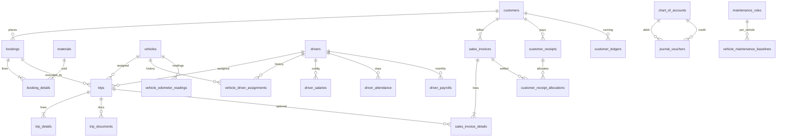

# DATABASE_DESIGN.md

Database design from JPA entities and Flyway migrations **V1–V53**.

**This file does not create or alter the database.**

- **Existing** = tables/columns found in code/migrations.
- **Proposed/Future** = recommended schema for planned modules. **Do not treat as live.**

PostgreSQL database name in dev: `transport_erp`. Hibernate `ddl-auto: validate`. JSONB: **not currently identified**.

---

## Shared conventions (existing)

Almost every business table follows `BaseEntity`:

| Column | Type (typical) | Role |
|--------|----------------|------|
| `id` | `BIGSERIAL` / `BIGINT` | PK |
| `code` | `VARCHAR(50)` | Business/tenant code |
| `name` | `VARCHAR(150)` | Display name |
| `description` | `TEXT` | Optional |
| `status` | `VARCHAR(20–50)` | String lifecycle or `ACTIVE` |
| `company_id` | `BIGINT` | Tenant |
| `branch_id` | `BIGINT` | Optional branch |
| `created_by` / `updated_by` | `VARCHAR` | Audit user |
| `created_date` / `updated_date` | timestamp | Audit |
| `is_deleted` | `BOOLEAN` | Soft delete |
| `version` | `INT` | `@Version` optimistic lock |

**Rule:** new tables should include these columns even if the first domain columns are documented below.

---

## Existing database design

### Logical relationships (as implemented)

---

### Platform / identity

#### `companies`

- **Purpose:** Tenant company.
- **Important columns:** GST, PAN, CIN, phone, email, website, address, SaaS fields (later migrations).
- **PK:** `id`. **Status/audit:** BaseEntity.

#### `branches`

- **Purpose:** Company location/scope.
- **FK:** company via `company_id`.

#### `app_users`

- **Purpose:** Login accounts.
- **Important columns:** `username` unique, `password` (BCrypt), `email`, `phone`, `company_id`, `branch_id`.
- **Relationships:** many-to-many roles (`app_user_roles` or equivalent join table).

#### `app_roles` / `app_permissions`

- **Purpose:** RBAC.
- Tenant-scoped role codes (V34).

#### `refresh_tokens`, `login_history`, `audit_logs`

- **Purpose:** Auth session and audit trail.

#### SaaS tables (exist)

`saas_plans`, licenses, tenant subscriptions, billing invoices, announcements, support tickets/replies, backups, system settings. Used by platform admin, **not** by the construction-trip operational loop.

---

### Masters

#### `customers`

| | |
|--|--|
| Purpose | Buyer master |
| Extra columns | `email`, `phone`, `address`, `gst_number`, `credit_limit NUMERIC(15,2)` |
| PK | `id` |
| Children | contacts, delivery sites, documents, ledger, bookings, invoices, receipts |

#### `customer_contacts` / `customer_delivery_sites` / `customer_documents`

- Sites used as `bookings.delivery_site_id`.
- Documents stored with file metadata (pattern similar to trip documents).

#### `drivers`

| | |
|--|--|
| Purpose | Driver master |
| Extra columns | `license_number` NOT NULL, `license_expiry_date`, `phone_number` |
| Children | salary, attendance, documents, payrolls, trips, fuel, expenses |

#### `driver_salaries`

| | |
|--|--|
| Purpose | Salary **configuration** for a driver (not a payslip) |
| Columns | `driver_id` FK, `basic_salary NUMERIC(12,2)`, `overtime_rate NUMERIC(12,2)`, `advance_taken NUMERIC(12,2)` |
| PK | `id` |
| Business rule | Advance is a stored number, not a transaction log |

#### `driver_attendance`

| | |
|--|--|
| Purpose | Daily attendance |
| Columns | `driver_id`, `attendance_date`, `status` (`PRESENT`, `ABSENT`, `LEAVE`, `HALF_DAY`) |

#### `vehicles`

| | |
|--|--|
| Purpose | Fleet master |
| Extra columns | chassis, engine, model, brand, type/category/capacity lookup FKs, owner, purchase date, insurance/fitness/permit expiry, `current_odometer_km NUMERIC(12,2)`, `odometer_updated_at` |

#### `vehicle_documents`

Vehicle file attachments.

#### `vehicle_driver_assignments`

| | |
|--|--|
| Purpose | Standing vehicle↔driver assignment |
| Columns | `vehicle_id`, `driver_id`, `assignment_date`, `removal_date` |

#### `vehicle_odometer_readings` (V52)

| | |
|--|--|
| Purpose | Odometer history |
| Columns | `vehicle_id`, `reading_km`, `reading_at`, `source` (`OPENING`, `MANUAL`, `CORRECTION`), `reason`, optional `fuel_entry_id`, `work_order_id` |
| Note | `work_order_id` is a **column only**; work-order table **not currently identified** |

#### `vehicle_services` (`VehicleServiceLog`)

| | |
|--|--|
| Purpose | Service history / cost (not PM due engine) |
| Columns | `vehicle_id`, `service_type`, `service_date`, `next_service_date`, `workshop`, `cost`, `status` (`DRAFT`, `APPROVED`, `CANCELLED`), `payment_method` |
| Accounting fields | Added in V45 |

#### `maintenance_rules` (V53)

| | |
|--|--|
| Purpose | Company PM rule (km and/or days) |
| Columns | `maintenance_type`, `trigger_mode`, `interval_km`, `interval_days`, `due_soon_km`, `due_soon_days` |
| Status | Rule master `ACTIVE`; due **status is computed in Java**, not stored as a due table |

#### `vehicle_maintenance_baselines` (V53)

| | |
|--|--|
| Purpose | Last service km/date per vehicle per rule |
| Columns | `rule_id`, `vehicle_id`, `last_service_km`, `last_service_date` |

#### `materials`

| | |
|--|--|
| Purpose | Material master (M-Sand, gravel, etc.) |
| Columns | `category_id`, `unit_id` (lookups), `default_uom_id`, `default_rate NUMERIC(12,2)`, `density NUMERIC(8,3)` |

#### `material_prices`

Price lists. Exact uniqueness **not fully restated here** — read V8 / entity before changing.

#### `uom_master` / `uom_conversions` (V51)

Units of measure and conversion factors.

#### `quarries`

| | |
|--|--|
| Purpose | Loading source master |
| Columns | `location_address`, `owner_name`, `contact_number`, `gst_number`, `license_number`, `latitude`, `longitude`, `working_hours` |

#### `loading_locations`

| | |
|--|--|
| Purpose | Named loading points + default charges |
| Columns | `location_code`, `loading_point`, `loading_charges NUMERIC(12,2)`, geo |

#### `lookup_values`

Shared lists (vehicle type, material category, etc.).

#### `suppliers`

Vendor master (exists; not the center of the trip chain).

---

### Operations

#### `bookings`

| | |
|--|--|
| Purpose | Customer order header |
| Columns | `booking_number`, `booking_date`, `customer_id` NOT NULL, `delivery_site_id`, `status` default `PENDING`, `priority` default `MEDIUM`, `remarks` |
| PK | `id` |
| FK | `customer_id` → customers; `delivery_site_id` → customer_delivery_sites |
| Indexes | See V9 |

#### `booking_details`

| | |
|--|--|
| Purpose | Material requirement **lines** (current implementation of “material requirement”) |
| Columns | `booking_id`, `material_id`, `quantity`, `rate`, `transport_rate`, `royalty_rate`, `loading_charge`, `gst_percentage` default 18 |
| FK | booking, material |
| Delete | Cascaded with header in typical JPA `orphanRemoval` |

#### `trips`

| | |
|--|--|
| Purpose | Execution header |
| Columns | `trip_number`, `trip_date`, `booking_id` NOT NULL, `vehicle_id`, `driver_id`, `status` default `PLANNED`, `remarks` |
| FK | booking CASCADE on V10; vehicle/driver SET NULL |
| Indexes | `idx_trip_booking`, `idx_trip_vehicle`, `idx_trip_driver` |
| Status strings | Migration comment: PLANNED, DISPATCHED, COMPLETED, CANCELLED. Dashboard may use additional strings. |

#### `trip_details`

| | |
|--|--|
| Purpose | Trip material lines + dispatch/delivery timestamps |
| Columns | `trip_id`, `material_id`, `quantity`, `rate`, `loading_charges`, `royalty`, `dispatch_time`, `arrival_time` |

#### `trip_documents`

| | |
|--|--|
| Purpose | POD and other trip files |
| Columns | `trip_id`, `doc_type`, `doc_number`, `file_path`, `file_name`, `mime_type`, `file_size`, `remarks` |
| `doc_type` | `POD`, `DELIVERY_CHALLAN`, `WEIGHBRIDGE_SLIP`, `LOADING_PHOTO`, `DELIVERY_PHOTO`, `OTHER` |
| BaseEntity | Backfilled in V50 |

**There is no `pods`, `dispatches`, `deliveries`, or `loadings` table.**

#### `fuel_requests`

| | |
|--|--|
| Purpose | Ask for fuel against a trip |
| Columns | `request_number`, `trip_id` NOT NULL, requested/fulfilled qty and amount, `status` default `PENDING`, requested_by, approved_by, `fuel_entry_id` |
| Lifecycle | PENDING, APPROVED, REJECTED, FULFILLED, CANCELLED (V47) |

#### `fuel_entries`

| | |
|--|--|
| Purpose | Actual fuel fill |
| Columns | `fuel_entry_number`, `fuel_date`, `vehicle_id`, `driver_id`, optional `trip_id`, `fuel_request_id`, `fuel_station`, quantity/amount fields (see entity for full list) |

#### `expenses`

| | |
|--|--|
| Purpose | Operating expenses |
| Columns | `expense_number`, `expense_date`, `category`, optional `vehicle_id`/`driver_id`/`trip_id`, `amount`, `gst_amount`, `total_amount`, `payment_method` default CASH, `status` default `SUBMITTED`, `attachment_path` |
| Categories (comment) | TOLL, DRIVER_BATA, PARKING, VEHICLE_REPAIR, INSURANCE, OFFICE |

---

### Finance

#### `sales_invoices`

| | |
|--|--|
| Purpose | Customer invoice header |
| Columns | `invoice_number`, `invoice_date`, `customer_id`, `status` default `DRAFT`, `payment_terms`, `subtotal`, `discount`, `net_amount`, `paid_amount`, `payment_status` default `UNPAID` |

#### `sales_invoice_details`

| | |
|--|--|
| Purpose | Invoice lines |
| Columns | `invoice_id`, optional `trip_id`, `material_id`, `quantity`, `rate`, `freight_charges`, `loading_charges`, plus further amount columns on entity |

#### `customer_receipts`

| | |
|--|--|
| Purpose | Customer payment |
| Columns | `receipt_number`, `receipt_date`, `customer_id`, optional `booking_id`, `amount_received`, `advance_amount`, `payment_method`, `reference_number`, `remarks`, `approved_by`, `approved_at` |
| Children | allocations; audit/print audit tables (V38–V43) |

#### `customer_receipt_allocations`

| | |
|--|--|
| Purpose | Apply receipt to invoices |
| Columns | `receipt_id`, `invoice_id`, `allocated_amount NUMERIC(12,2)` |

#### `customer_ledgers`

| | |
|--|--|
| Purpose | Customer running ledger (this **is** the AR subledger) |
| Columns | `customer_id`, optional `receipt_id`, optional `invoice_id` (V44), `debit_amount`, `credit_amount`, `running_balance`, `remarks` |

**There is no `driver_ledgers` table.**

#### `chart_of_accounts`

| | |
|--|--|
| Purpose | GL accounts |
| Columns | `account_code`, `account_name`, `account_type` (ASSET, LIABILITY, EQUITY, INCOME, EXPENSE), `opening_balance`, `running_balance` NUMERIC(15,2) |

#### `journal_vouchers`

| | |
|--|--|
| Purpose | Two-sided GL entry |
| Columns | `voucher_number`, `voucher_date`, `reference_number`, `description`, `debit_account_id`, `credit_account_id`, `amount` |
| Not present | `journal_voucher_lines` |

#### `financial_years`

Accounting year master.

#### `driver_payrolls` (V46)

| | |
|--|--|
| Purpose | Monthly driver payslip |
| Columns | `payroll_number` UNIQUE, `driver_id`, `pay_year`, `pay_month`, `basic_salary`, `allowance_amount`, `deduction_amount`, `advance_adjustment`, `net_salary_payable`, `payment_method`, `status` default `DRAFT`, `accrual_jv_number`, `payment_jv_number`, `cancellation_jv_number` |
| Constraints | `uk_driver_payroll_period UNIQUE (driver_id, pay_year, pay_month)` |
| Indexes | `idx_driver_payroll_company_status (company_id, status)`, `idx_driver_payroll_driver` |
| Status | DRAFT, APPROVED, PAID (application-enforced) |

---

### Other existing tables

| Table / entity | Purpose |
|----------------|---------|
| `app_settings` | Tenant settings (V35 scoped) |
| `report_templates`, `scheduled_reports` | Reports (V16) |
| `gps_tracking` | GPS stub (V17) |
| `ai_predictions` | AI stub (V17) |
| Document number sequences | Tenant-scoped numbering (V37) |

---

## Important existing business rules (data)

1. Soft delete: filter `is_deleted = false`.
2. Tenant: always constrain `company_id`.
3. One payroll per driver per calendar month (`UNIQUE`).
4. Trip **requires** a booking; vehicle/driver optional at DB level.
5. Receipt allocations require an invoice.
6. Invoice lines may omit `trip_id`.
7. Optimistic locking via `version`.
8. Do not store PM due status; compute it.
9. `maintenanceDueCount` (fitness) ≠ maintenance rules due.
10. POD is `trip_documents.doc_type`, not a FK from invoices.

---

## Proposed / future database design

The following tables **do not exist**. They are a **recommended** shape if/when those modules are built. Align names with `BaseEntity` and tenant columns. **Do not create these migrations unless explicitly implementing the feature.**

### Customer / material requirement (if split from booking)

**`material_requirements`** (optional header)

- `customer_id`, `required_date`, `status` (`DRAFT`, `CONFIRMED`, `CONVERTED`)
- Converted bookings store `material_requirement_id` on `bookings` (new FK)

**`material_requirement_details`**

- `material_id`, `quantity`, requested site

**Only needed if** the business wants demand capture before a commercial booking. Today `booking_details` is enough.

---

### Driver salary configuration (extension)

Existing `driver_salaries` can be extended **or** replaced by:

**`driver_pay_profiles`** (proposed)

| Column | Meaning |
|--------|---------|
| `driver_id` | FK |
| `pay_model` | `MONTHLY` / `PER_TRIP` / `PER_KM` / `PER_TON` / `MIXED` |
| `basic_salary` | Monthly component |
| `per_trip_rate` | |
| `per_km_rate` | |
| `per_ton_rate` | |
| `bata_rate` | Per trip or per day — **configurable** |
| `effective_from` / `effective_to` | Dated rates |

Do not drop `driver_salaries` without a migration path.

---

### Driver transaction / ledger (proposed)

**`driver_ledgers`** — mirror `customer_ledgers`:

- `driver_id` NOT NULL
- `entry_date`
- `debit_amount`, `credit_amount`, `running_balance`
- Optional FKs: `payroll_id`, `settlement_id`, `payment_id`, `advance_id`, `expense_id`
- `remarks`

This is the traceable **driver ledger**. Payroll JV numbers alone are not a ledger.

---

### Driver settlement pack (proposed)

**`driver_settlements`**

| Column | Notes |
|--------|--------|
| `settlement_number` | Unique per company |
| `driver_id` | |
| `period_from` / `period_to` | Trip-wise period (not necessarily calendar month) |
| `status` | `DRAFT`, `CALCULATED`, `SUBMITTED`, `APPROVED`, `POSTED`, `PAID` |
| `gross_earnings` / `total_deductions` / `net_payable` | |
| `accrual_jv_number` / `payment_jv_number` | Like payroll |

**`driver_settlement_details`**

- `settlement_id`
- `line_type` (`TRIP_EARNING`, `BATA`, `ALLOWANCE`, `INCENTIVE`, `BONUS`, `ADVANCE_RECOVERY`, `DEDUCTION`, `FINE`, `ADJUSTMENT`, `SALARY`)
- `source_trip_id` nullable
- `quantity` / `rate` / `amount`
- `description`

**`driver_trip_settlements`** (optional link table)

- `settlement_id`, `trip_id` unique pair
- Snapshot km, tons, calculated earning

Keep **`driver_payrolls`** for monthly salary if the business still pays a retainer; settlements can reference `payroll_id` or include a `SALARY` line.

---

### Driver attendance

**Exists.** Future: overtime hours, night halt — add columns on `driver_attendance` rather than a new table unless needed.

---

### Driver allowance / advance / deduction / payment (proposed first-class docs)

| Proposed table | Purpose | Why not now |
|----------------|---------|-------------|
| `driver_allowances` | Dated allowance awards | Today lump sum on payroll |
| `driver_advances` | Advance vouchers with outstanding balance | Today `advance_taken` scalar |
| `driver_deductions` | Fines/recoveries with reason | Today lump sum |
| `driver_payments` | Disbursements not tied only to payroll | Today payroll `PAID` |

Each should post to `driver_ledgers` and optionally `journal_vouchers`.

---

### Vehicle / material / quarry / booking / trip

**Existing tables are sufficient** for the current product. Proposed extras only if operations demand them:

| Proposed | When to add |
|----------|-------------|
| `loadings` | Weighbridge ticket required as its own document with net weight, quarry_id, loading_location_id |
| `dispatches` | If dispatch must be a numbered legal document separate from trip status |
| `deliveries` | If multiple drops per trip need their own POD and receiver name |
| `pods` | If POD must have verification status, GPS, signature, and invoice gate |

Until then, **use `trip_documents` + `trip_details` timestamps**.

---

### Expense / invoice / payment / accounts

**Existing.** Proposed GL upgrade (recommended, not required):

**`journal_voucher_lines`**

- `voucher_id`, `account_id`, `debit`, `credit`, `narration`
- Balanced Σ debit = Σ credit

Only introduce this if two-account vouchers become too limiting. Migrating historical `journal_vouchers` would be a dedicated project.

---

## Mapping: user-requested areas vs database

| Area | Existing table(s) | Proposed if building the full lifecycle |
|------|-------------------|----------------------------------------|
| Customer | `customers` + children | — |
| Driver | `drivers` | — |
| Driver salary configuration | `driver_salaries` | `driver_pay_profiles` |
| Driver transaction | **None** | `driver_ledgers` |
| Driver settlement | **None** (payroll is different) | `driver_settlements` |
| Driver settlement detail | **None** | `driver_settlement_details` |
| Driver attendance | `driver_attendance` | extend columns |
| Driver trip settlement | **None** | `driver_trip_settlements` |
| Driver allowance | payroll `allowance_amount` | `driver_allowances` |
| Driver advance | `advance_taken` | `driver_advances` |
| Driver deduction | payroll `deduction_amount` | `driver_deductions` |
| Driver payment | payroll `PAID` | `driver_payments` |
| Vehicle | `vehicles` + related | — |
| Material | `materials` | — |
| Quarry | `quarries` | — |
| Booking | `bookings` / `booking_details` | optional requirement header |
| Trip | `trips` / `trip_details` | — |
| Loading | `loading_locations` + line charges | `loadings` |
| Dispatch | `trips.status` / `dispatch_time` | `dispatches` |
| Delivery | `arrival_time` / delivery sites | `deliveries` |
| POD | `trip_documents` | `pods` |
| Expense | `expenses` | — |
| Invoice | `sales_invoices` | — |
| Payment | `customer_receipts` | — |
| Accounts | `chart_of_accounts`, `journal_vouchers` | optional line table |

---

## Flyway index (existing)

| Range | Themes |
|-------|--------|
| V1–V4 | Baseline, masters, auth, company |
| V5–V8 | Vehicle, driver, customer, material/quarry |
| V9–V12 | Booking, trip, fuel, expense |
| V13–V16 | Receipts/ledger, invoices, GL, reports |
| V17 | GPS/AI stubs |
| V18–V28 | BaseEntity backfills, lookups |
| V29–V37 | SaaS, tenant scoping, document numbers |
| V38–V45 | Receipt allocations/approval/print, ledger invoice_id, vehicle service accounting |
| V46–V51 | Payroll, fuel fulfillment, assignment integrity, uploads, UOM, trip_documents columns |
| V52–V53 | Odometer, maintenance rules/baselines |

Next migration must be **V54+**. Never rewrite applied versions in shared/prod databases.
