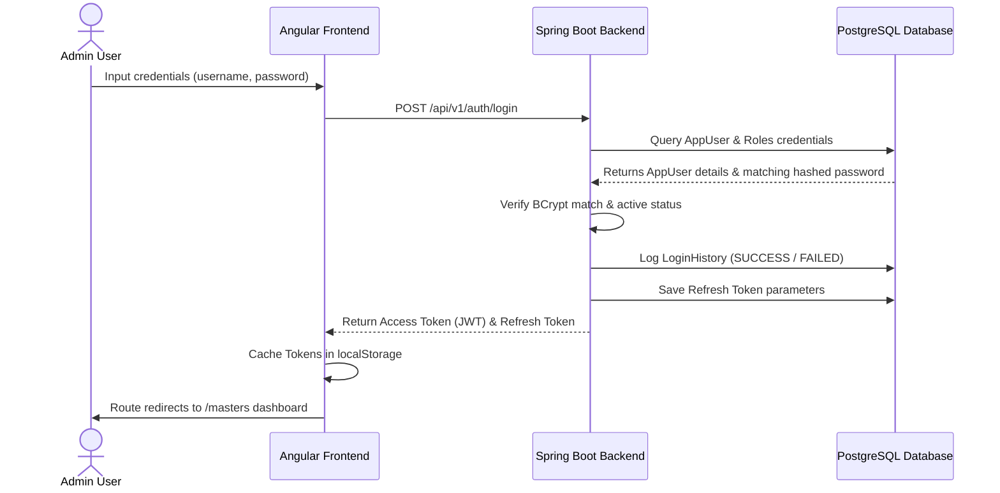

# Authentication & Authorization Module Documentation (Phase 3)

This document details the architecture, schemas, and endpoint design for the Authentication and Authorization module of the Transport ERP.

---

## 1. Authentication Flows & Sequence
The system employs a standard JWT Bearer token-based verification process:

---

## 2. Database Schema Structures
The module targets the following database entities:
- **`app_users` / `app_roles` / `app_permissions`**: User identities, roles, and functional permissions.
- **`refresh_tokens`**: Stores active UUID refresh keys mapping users to session states.
- **`login_history`**: Tracks username, IP address, user-agent, and status (SUCCESS / FAILED).
- **`audit_logs`**: Logs actions, targets (entity name + ID), timestamps, and executing user info.

---

## 3. Backend REST APIs Catalog

| Method | Endpoint | Request Body | Description |
| :--- | :--- | :--- | :--- |
| **POST** | `/api/v1/auth/login` | `{ username, password }` | Authenticates user, generates JWT + refresh token. |
| **POST** | `/api/v1/auth/logout` | None | Revokes the current active session. |
| **POST** | `/api/v1/auth/refresh` | `{ refreshToken }` | Renews expired JWT. |
| **POST** | `/api/v1/auth/forgot-password` | `{ email }` | Triggers recovery instruction email. |
| **POST** | `/api/v1/auth/reset-password` | `{ username, token, newPassword }` | Updates credentials with token validation. |
| **PUT** | `/api/v1/auth/change-password` | `{ oldPassword, newPassword }` | Validates current password and updates. |
| **GET** | `/api/v1/auth/profile` | None | Returns active user profile specifications. |
| **PUT** | `/api/v1/auth/profile` | `{ name, email, phone, description }` | Modifies active user details. |

---

## 4. Frontend Angular Scaffolding
- **`AuthService`**: Standardizes http auth commands and state parameters.
- **`authGuard`**: Protects secure layouts and routes, redirecting unauthenticated traffic to `/login`.
- **`jwtInterceptor`**: Automatically injects `Authorization: Bearer <token>` header to api calls.
- **UI Screens**:
  - `LoginComponent` (SCR-001)
  - `ForgotPasswordComponent` (SCR-002)
  - `ResetPasswordComponent` (SCR-003)
  - `UserProfileComponent` (SCR-005)
  - `AccessDeniedComponent` (SCR-006)
