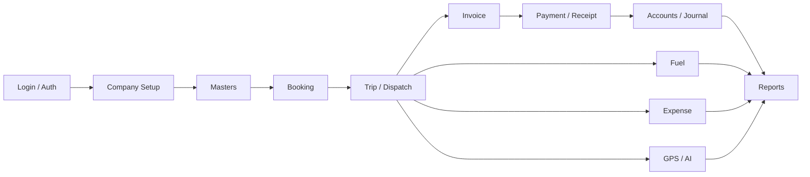
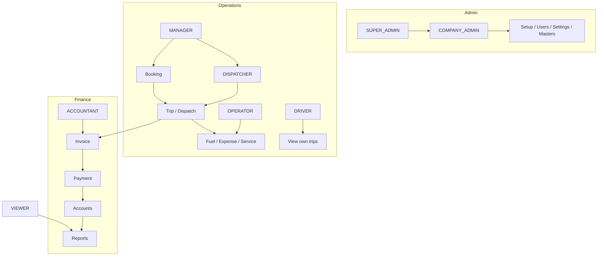

# FleetFlow ERP — Role-Based Project Flow

## Business process flow

## Roles (from seed data)

| Role | Code | Permissions | Primary scope |
|------|------|-------------|---------------|
| Super Administrator | `SUPER_ADMIN` | All 10 | Entire ERP |
| Company Administrator | `COMPANY_ADMIN` | All 10 | Company, branches, users, settings |
| Operations Manager | `MANAGER` | VIEW, CREATE, EDIT, APPROVE, REJECT, EXPORT, PRINT | Bookings, dispatch, drivers |
| Dispatcher Manager | `DISPATCHER` | VIEW, CREATE, EDIT, APPROVE, PRINT | Trips allocation & scheduling |
| Data Operator | `OPERATOR` | VIEW, CREATE, EDIT, PRINT | Fuel, maintenance, daily ops |
| Accountant Controller | `ACCOUNTANT` | VIEW, CREATE, EDIT, APPROVE, EXPORT, PRINT | Invoices, receipts, ledger |
| Company Driver | `DRIVER` | VIEW | Own allocated trips |
| Guest Viewer | `VIEWER` | VIEW | Dashboards & reports read-only |

## Permissions catalog

`FULL_ACCESS` · `VIEW` · `CREATE` · `EDIT` · `DELETE` · `APPROVE` · `REJECT` · `EXPORT` · `IMPORT` · `PRINT`

## Role tracks

## Sources

- `transport-backend/src/main/resources/db/demo/003_roles.sql`
- `transport-backend/src/main/resources/db/demo/008_abc_demo_users.sql`
- `transport-backend/.../DataInitializer.java` (bootstrap SUPER_ADMIN)
- Frontend menu: `app-shell.ts` (Masters / Operations / Finance / Admin)

## Note

JWT `authGuard` protects routes today. Role × module menu filtering is the **intended** model from seeds; wire `FfPermissionService` / role checks into the shell if you want hard UI ACL next.
